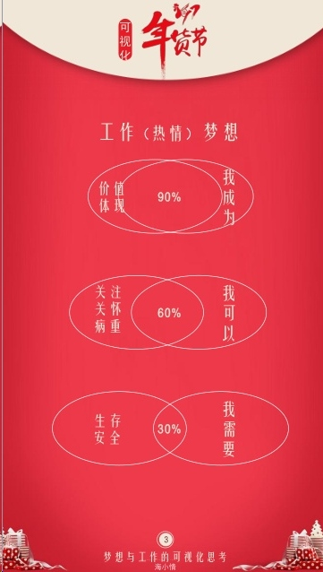
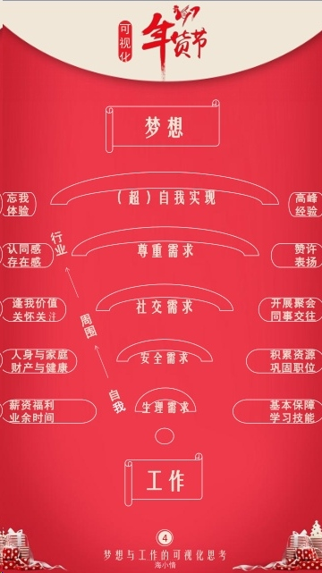

# [事业]梦想与工作的可视化思考
演讲者——海小情，一位从化妆品行业改行到金融行业的培训师。

长大了，你想要做什么？
进入大学选专业的时候，你还记得你写过的那篇《梦想》的作文吗？

##一、什么是梦想？

大学毕业进入社会以后，这时候的我们还记得自己的梦想？从事自己梦想中的工作？我们通常是一边想着自己的梦想，但是，却又做着跟自己的梦想毫无关系的工作。从事跟自己梦想越接近的工作，我们投入的热情反而更多，成就自己的梦想会越快。
##二、梦想与工作的连接

从我需要，到我成为，这个过程本身也是我们自身价值的一种体验，所以我们热情也不不一样。
当我们的自我价值可以体现，变成我们自己想成为的那个人，我们的热情度，就会达到90%，甚至会更多。
一味只想着自己想成为什么样的人，不然沉淀下来，捋捋自己的思绪，从现实的角度出发，现在的自己处于一个怎样的状态中。
##三、从工作到梦想的路程

马斯洛的基础理论，从初进社会开始，我们独立了，为了自己的生活，我们需要寻求一份可以提供基本保障的薪资福利的公司，来确保有生存的基础，在业余时间学习更多的技能。
生存满足后，会想到人身安全和财产安全。巩固自己的职位，多积累各方面的资源，需要3-5年，或者更长的时间。
我们需要社交得关怀，可以开展聚会，跟同事交往。
扩大自己的社交面，得到认同感和存在感，我们需要通过赞许和表扬得到尊重。
超越自我的实现，就是达到忘我的阶段。

写下自己的现状，和自己的需求，想想自己的梦想，现在的工作是否满足自己的梦想？
