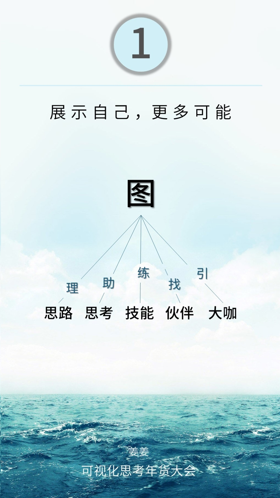
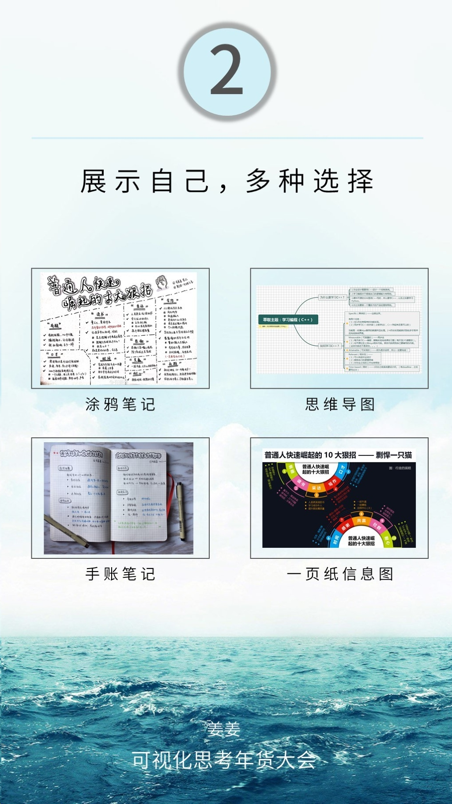
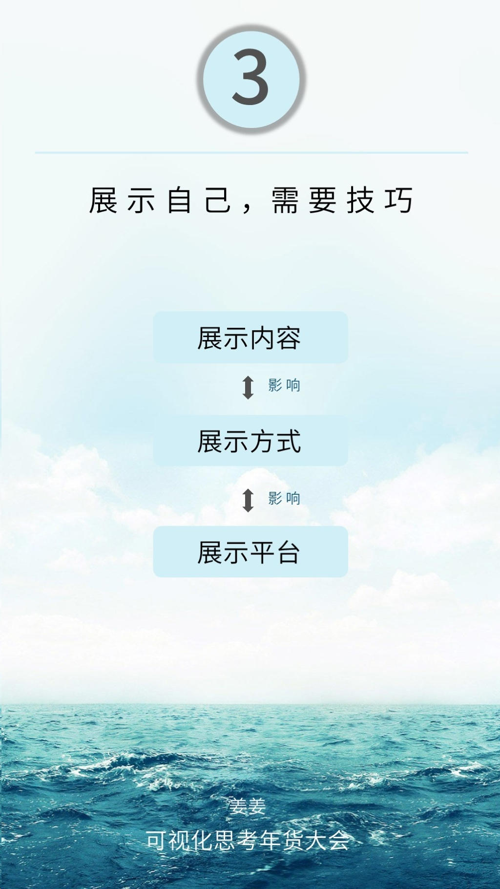
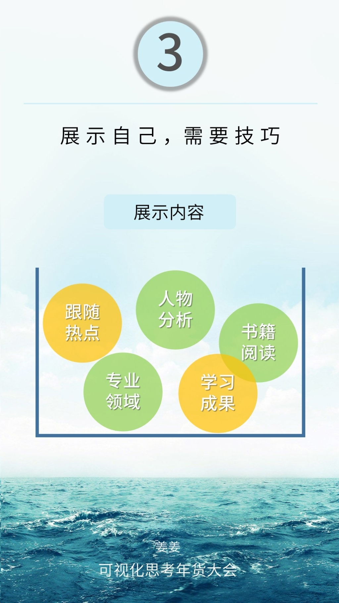
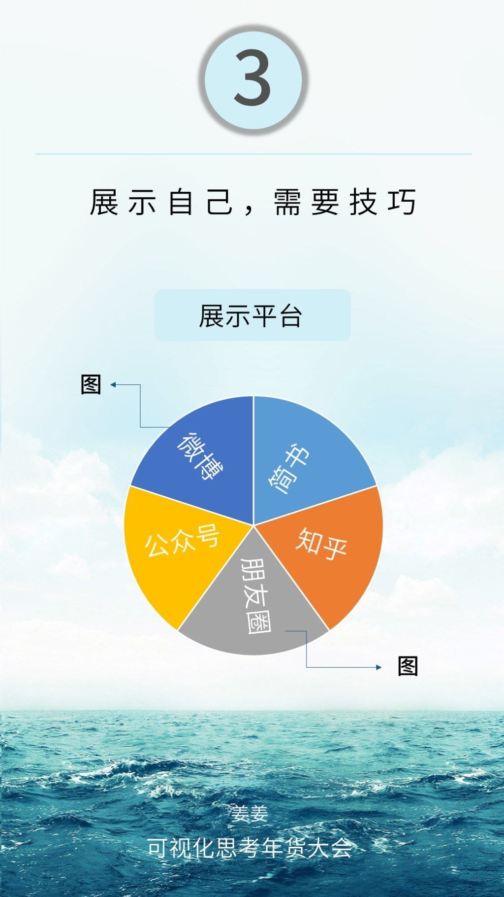

#用可视化思考展示自己
演讲者——姜姜

##一、展示自己，更多可能

**混乱思路，瞬间理清**
画图思考
**深度思考，长远目光**
思考后，将自己的想法画出来
**一技之长，价值建立**
画出来的图，才是自己的。
**同频伙伴，社群勾搭**
用图来链接自己感兴趣的伙伴。
**链接大咖，加速成长**
用图链接能够帮助自己的导师，加速自己的成长。
##二、展示自己，多种可能

有涂鸦笔记、思维导图、手帐笔记、一页纸信息图...
适合自己的，才是最好的！
##展示自己，需要技巧

展示内容、展示方式、展示平台，互相影响。
需要考虑对象和效果。

展示目的决定展示内容，展示的内容不单一。
跟随热点、人物分析、书籍阅读、专业领域、学习成果等等。
* 涂鸦笔记：色彩丰富、视觉享受，需要一些绘画技巧，容易陷入为画而画的陷阱。
* 思维导图：捋清思路，但是容易枯燥、分支较多，会产生视觉疲劳。
* 手帐笔记：不需要太多绘画技巧，比一页纸信息图内容多些。更适合用于复盘和理解。
* 一页纸信息图：思路清晰，但是若当事人不了解事情的时候，对于关键词会有部分不清楚。
根据展示的内容选择展示的方法。

展示平台：适合图展示的只有微博和朋友圈，其他比较适合图文结合分享。