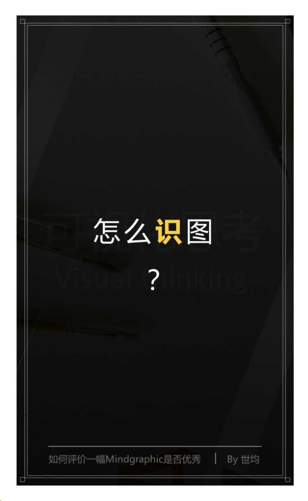

#优质可视化作品的N要素
演讲者——世均
##如何识图？

如何识图？不需要慧眼，要的是**套路**！

**套路1：画图的目的**

你画的图，别人是否可以看明白？是否准确地表达信息，图是否可以传递出去？
所以，画图首先考虑的就是明确地告诉他人，自己想表达的信息，并且让读图的人得以理解。
需要注意逻辑表达是否正确。

**套路2：把握设计度**

画图时的设计把握好【度】，过简或过度设计都会造成阅读障碍。

**套路3：系统的思维**

8种思维导图结构的说明：
* 圆圈图-定义一件事
* 气泡图-描述事情性质和特征
* 双重气泡图-比较和对照
* 树状图-分类
* 流程图-次序（事情的发展）
* 多重流程图-因果关系
* 环抱图-局部和整体
* 桥状图-描述事物之间的相关性和相似性

结合四象限，黄金三分法，商业画布等等，将其应用到以后的画图上，解决问题，创造有价值的内容。
目的是构建成系统的框架，逻辑分明且有深度思考，布局有价值的信息点并主导各自的结构，分析信息之间隐藏的线索，呈现出多元化的思维。

