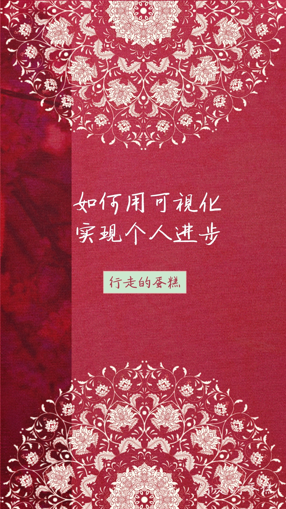
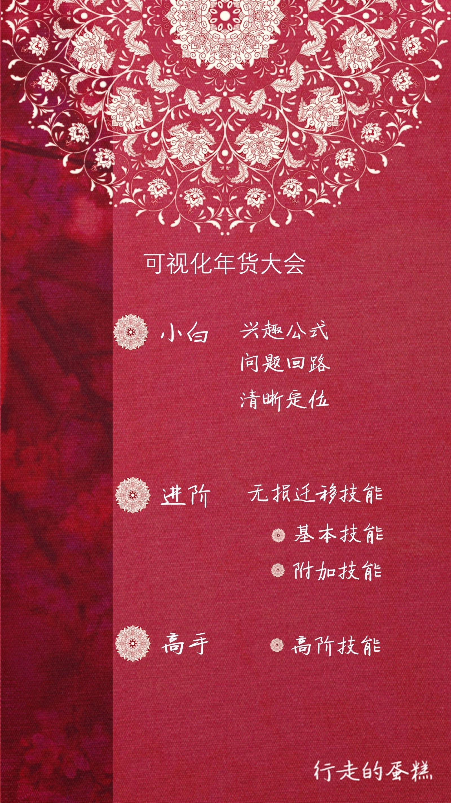
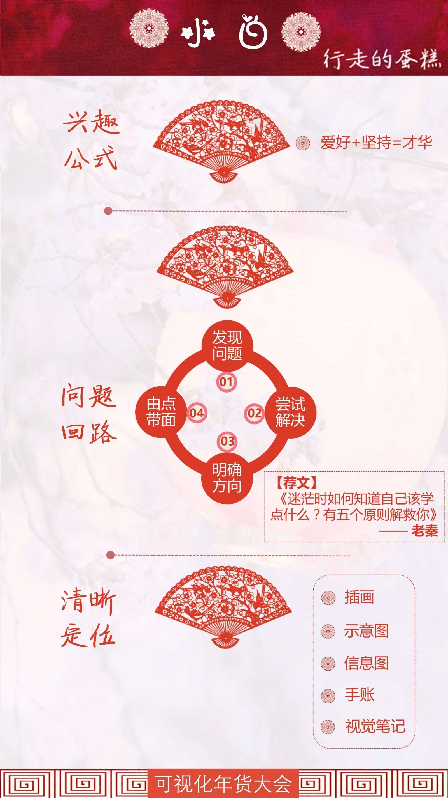
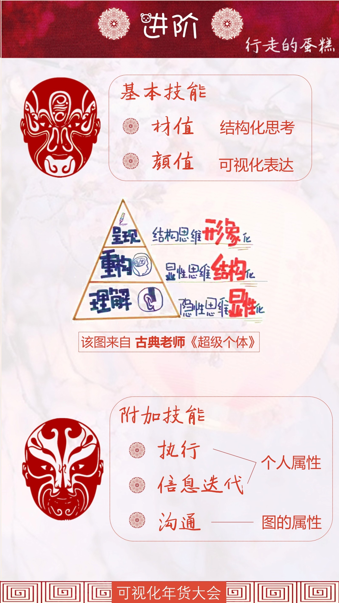
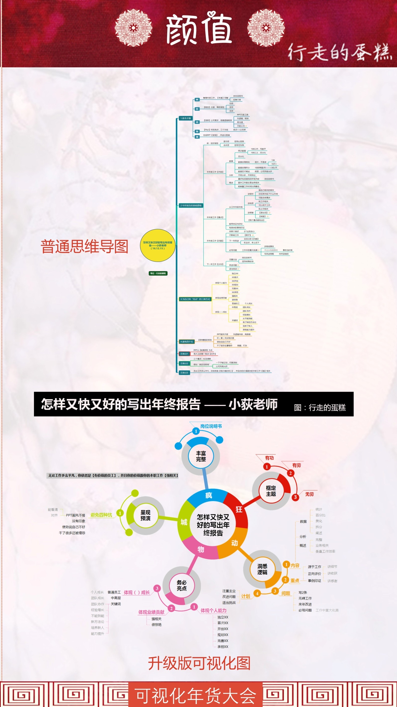
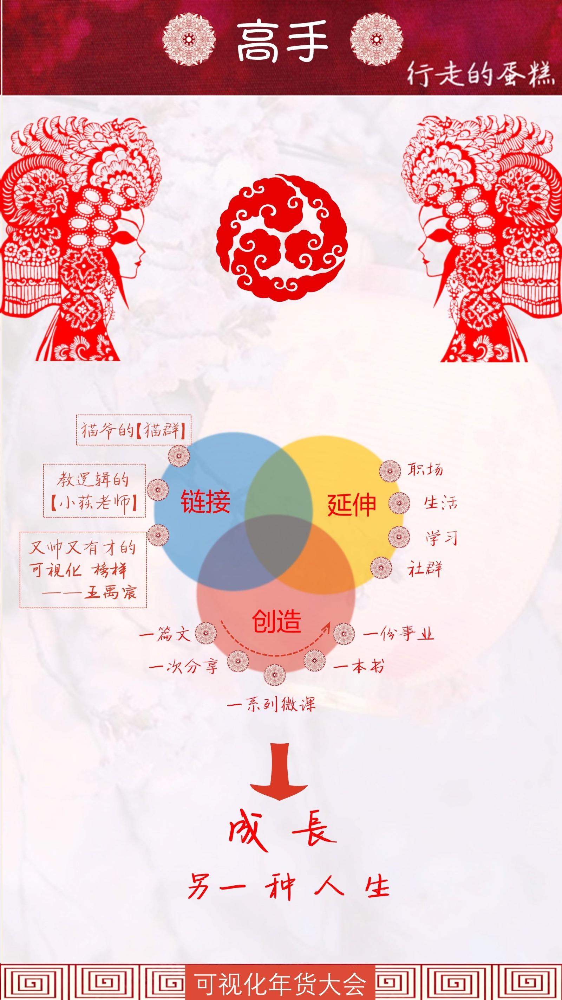
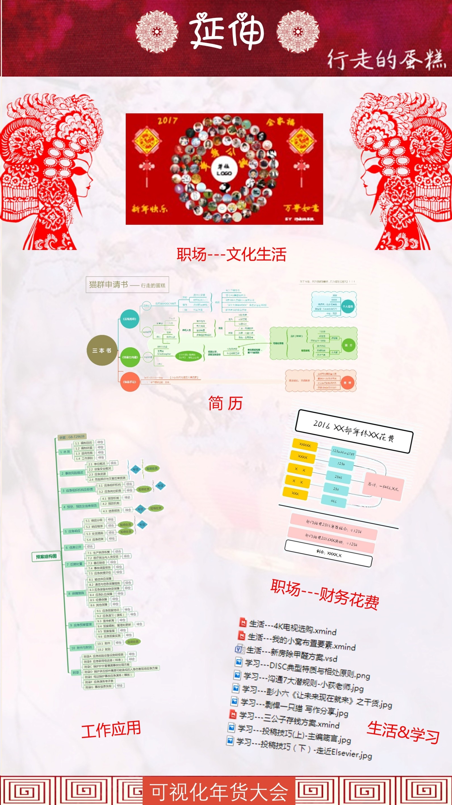

#如何用可视化实现个人进行
演讲者——蛋糕，爱好可视化，工程师，工科女。

##小白阶段

小白阶段——迷茫、不知道怎么办？
爱好需要挖掘，坚持自己的爱好，专注习惯的养成跟可视化思考有关。
挖掘爱好过程可以形成一个问题回路，就算有弯路也可以得到帮助。
最后，就可以清晰定位。
##进阶阶段

一张图：10秒内必须get到重点，不然没有价值。
表述内容需要更好的逻辑。

看脸时代，我们的图需要很好的颜值。
附加技能：
* 执行
* 信息迭代
* 沟通
##高手阶段

用可视化图成就自己的另一种人生，帮忙我们成为更好的自己！
##延伸

将可视化思考运用在生活中的方方面面。