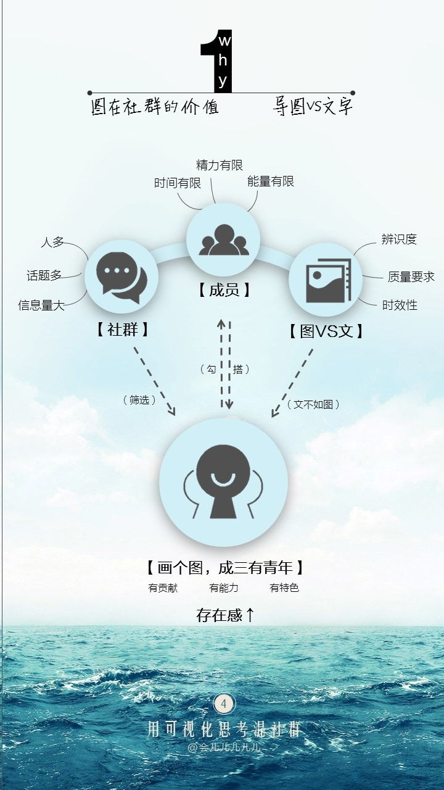
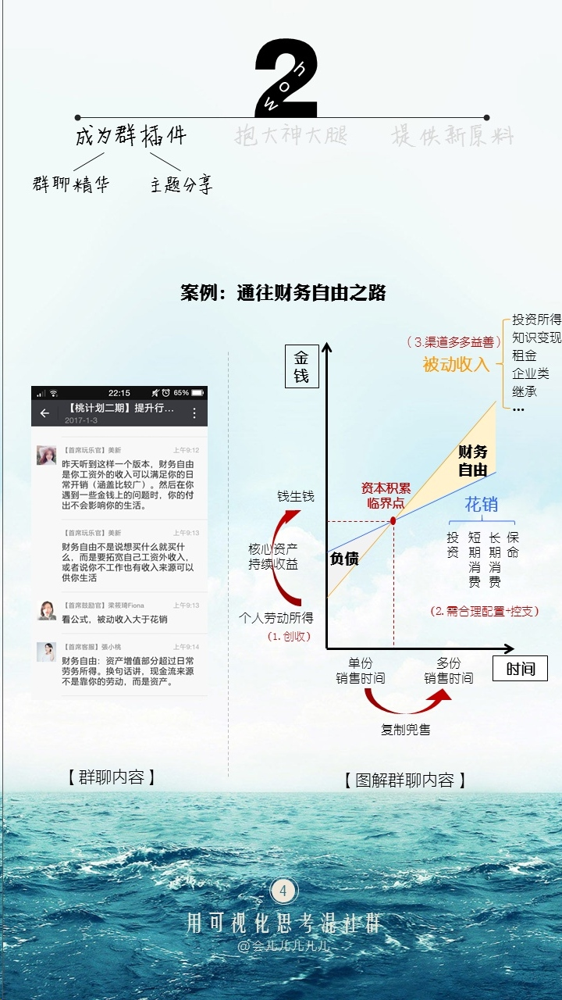
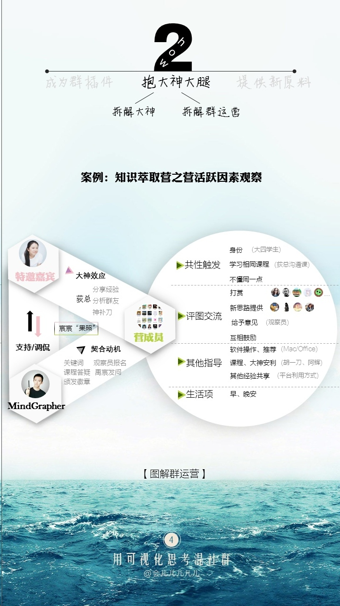
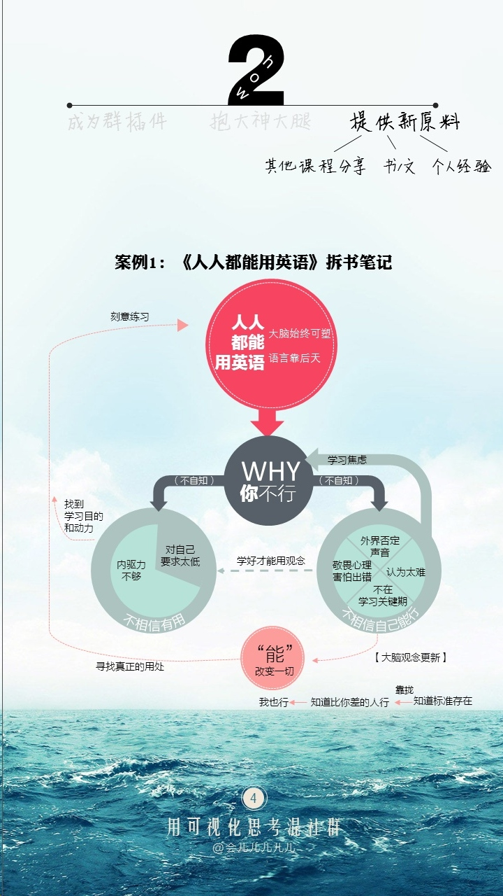
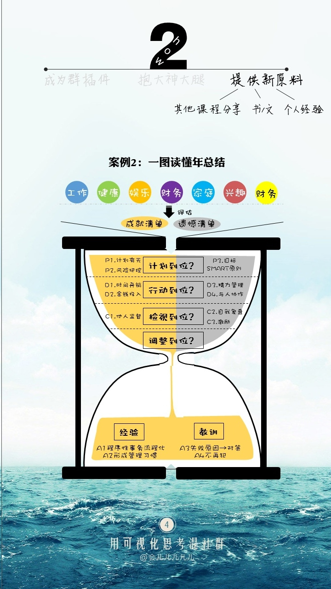
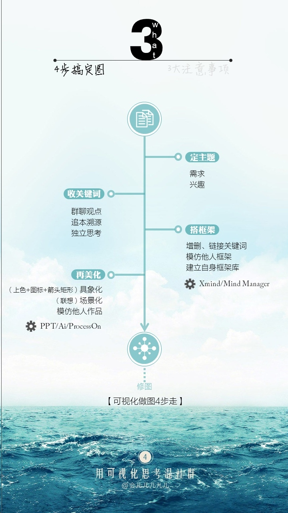
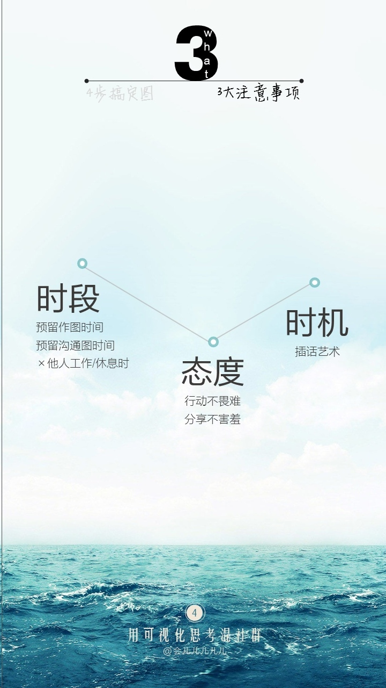

#首席绘图官是如何混社群的
演讲者——会儿，可视化思考的爱好者和践行者。

##图在社群的价值——导图VS文字

在社群中，有存在感的人共同点：有价值、有能力、有特色的人。
社群成员：时间有限、精力有限、能量有限
社群：话题多、信息量大、人多
如何在社群中提炼有用的知识？
这些问题解决了，在社群中的存在感就大了。做一位知识的搬运工，帮助成员筛选出有用的知识。
图的辨识度比文字更高，图容易表达自己想要说的意思，可以高度概括文章的内容，只要点开图就可以看到全部内容，更快速抓住内容。
图跟时效性相关性不大，一张图胜过千万个语言。
这些做到以后，我们的存在感就加大了。

##图成为群插件——群聊精华+主题分享

精华聊天内容和主题分享的内容，筛选对大家有用的信息，然后用图表达出来，减少成员处理信息的步骤。

##图是抱大神大腿神器——拆解大神+拆解群运营

图是抱大神大腿的神器。
拆解群里面高存在感的人、大神等等，可以拆解为什么这些人存在感更加的强？
群主或者群里的工作人员。

##图是提供新原料——其他课程分享+书/文+个人经验

其他知识、文章、书或者是自己的经验，例如旅游计划和年总结等等。
通过这些，可以找到同频的小伙伴。

##如何绘图——4步搞定图+3大注意事项

1. 选定主题：需求和兴趣
2. 收集关键词：群聊观点、追本溯源、独立思考
3. 搭建框架：增删、链接关键词、模仿他人框架、简历自身框架库
4. 图片美化：具象化（上色+图表+箭头矩形）、场景化（联想）、模仿他人作品

1. 时间段：预留足够的时间来画图
2. 态度：行动不畏难、分享不害羞
3. 时机：插话艺术
